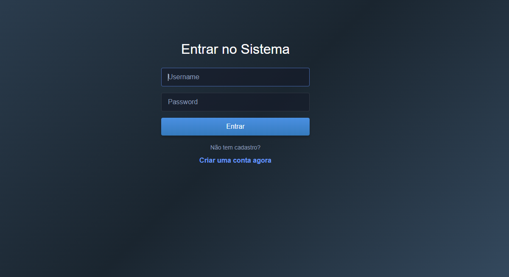
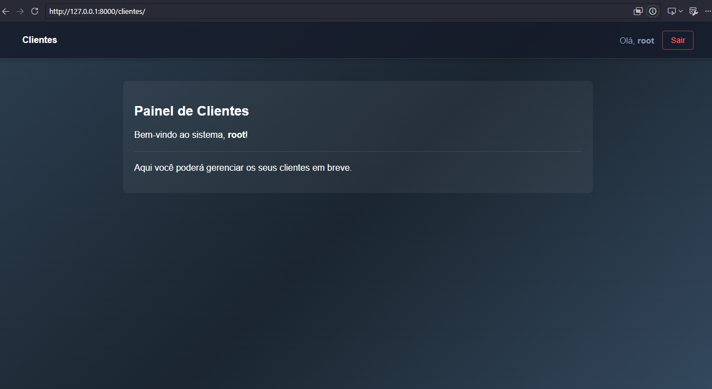

# Sistema Django - Gerenciamento de Clientes

Aplicação web desenvolvida com **Django** para autenticação de usuários e gerenciamento de clientes, contando com um design limpo e moderno em modo escuro.

## 🚀 Funcionalidades
- **Tela de Login Personalizada**: Redirecionamento automático na raiz do site para autenticação de usuários.
- **Cadastro Simplificado**: Criação de contas sem exigências complexas de senhas ou validações restritas de caracteres.
- **Painel de Clientes Protegido**: Acesso restrito apenas a usuários autenticados (`@login_required`).
- **Design Moderno**: Estilização customizada com gradientes e tema escuro.

## 🛠️ Tecnologias Utilizadas
- **Python** / **Django** (Framework Web)
- **HTML5** / **CSS3** (Interface e Layout Customizado)
- **SQLite** (Banco de dados padrão para desenvolvimento)

## ⚙️ Como Executar o Projeto

1. Clone o repositório ou abra a pasta do projeto.
2. Ative o ambiente virtual:
   - No Windows (PowerShell): `\.venv\Scripts\Activate`
3. Instale as dependências (se houver):
   - `pip install -r requirements.txt`
4. Aplique as migrações do banco de dados:
   - `python manage.py makemigrations`
   - `python manage.py migrate`
5. Inicie o servidor de desenvolvimento:
   - `python manage.py runserver`
6. Acesse no navegador: `http://127.0.0.1:8000/`